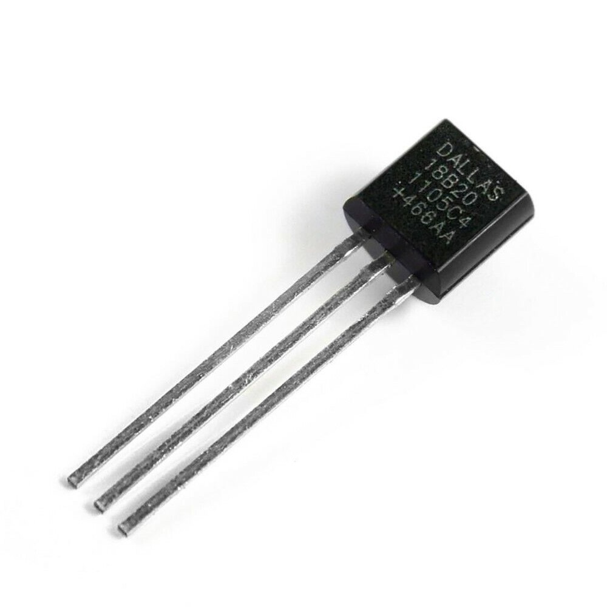

# wokwi-ds1820-custom-chip

- [DS18B20 chip data sheet](https://www.analog.com/media/en/technical-documentation/data-sheets/ds18b20.pdf)
- [DS18S20 chip data sheet](https://www.analog.com/media/en/technical-documentation/data-sheets/ds18s20.pdf)

The DS18B20 Custom Chip simulates the Dallas Semi (Maxim Integrated) One Wire Temperature Sensor of the same names. 

Currenly supported are the DS18B20 and DS18S20 chips.

The chip has the following pin groups

| Name         | Description                                            |
| ------------ | ------------------------------------------------------ |
| `VCC`   | Power pin          |
| `GND`     | ground pin                        |
| `DQ`      | Data Pin, used as I/O pin           |

### Addressing
The device uses OneWire compatible addresses, configurable as described below

### OneWire Comms 
The device uses OneWire for comms with the MCU. This custom chip implements a OneWire Slave (only)

A good Arduino library to use on the Arduino side is the OneWire and the Dallas Temperature Libraries (TBD)

## Implementation details
This chip supports all the functions of the hardware part. Commands are listed below

### Reset 
Write only. Resets the chip to power on. 

### Search
The device responds to the search command.
### Read
The device replies with its serial no bytes.

### Match
The device performs a match to the address sent by the master.

### Skip
The device skips to wait for function command.

### Alarm Search
If the last temperature conversion resulted in a temperature outside the range specified using Th and Tl, the device 
will respond with its address. Otherwise, only the first bit is transmitted.

### Convert
The device stores the temperature that is configured through `diagram.json` into the scratch pad.

### Write Scratchpad
The device writes the Th, Tl and Cfg bytes into the scratch pad.

### Read Scratchpad
The device transmits the contents of the scratch pad (9 bytes) to the master

### Copy Scratchpad
The device copies the contents of the Th, Tl (and Cfg for DS18B20) bytes from the scratchpad to its eeprom

### Recall 
The device copies the contents of the Th, Tl (and Cfg for DS18B20) bytes from its eeprom to the scratchpad

### Read Power Supply
The device behavior depends on the value of `deviceMode` attribute [see below](#devicemode)
When configured in Parasitic mode, the chip will pull down the wire when requested to indicate as much. When configured in VCC mode, the chip will leave the wire floating.

## Simulation behaviour
Since the implementation is intended to be used together with wokwi,
a simulation environment, the chip supports automatically changing 
the reported temperature according to a wave form at a particular 
frequency. 

The implemented frequency range is 0.0001 - 100 Hz.
There are four supported wave forms - Fixed, Sine, Square, Triangle. 

By default Fixed is used and the temperature is fixed; in this case
the value of the `temperature` attribute determines the reported 
temperature. The temperature can be changed during run time by clicking on the element.
If the wave form is one of other available forms 
and the frequency is within the range, the temperature will vary
between the values of the attributes `min_temp` and `max_temp` 
at the frequency specified by the `temp_wave_freq` attribute.

## Attributes
The chip defines a number of attributes that alter the behavior of the  operation when used in Wokwi. 

| Name         | Description                                            | Default value             |
| ------------ | ------------------------------------------------------ | ------------------------- |
| `ow_debug`   |  controls debug output for base one wire link layer code | `"0"`                 |
| `gen_debug`   |  controls debug output for the chip code | `"0"`                 |
| `device_id`   |  Specifies the unique 48bit device serial number. This is a string and the value should be limited to precisely 12hex digits Note the device serial's CRC is calculated during init | `"010203040506"`                 |
| `family_code`   |  Specifies the device family code. Supported values include `0x10`, `0x22`, `0x28` | `"0x10"`                 |
| `temperature`   |  Specifies the reported temperature. Float attribute should be in the range -55 .. 125 | `"0"` |
| `min_temp`   |  Specifies the minimum temperature in the range. Float attribute should be in the range -55 .. 125 | `"0"` |
| `max_temp`   |  Specifies the maximum temperature in the range. Float attribute should be in the range -55 .. 125 | `"0"` |
| `temp_wave_form`   |  Specifies the temperature wave form. String attribute with the following values: <li>`fixed` - fixed temperature value set to the value of the `temperature` attribute.<li>`sine` - a variable temperature changing using a sine wave form <li>`square` - a variable temperature changing using a square wave form <li>`triangle` - a variable temperature changing using a triangle wave form | `"fixed"` |
| `temp_wave_freq`   |  Specifies the frequency in Hz the temperature changes in. Float attribute should be in the range 0.0001 .. 100.  | `"0"` |

## Simulator examples

- [DS18B20 Custom Chip](https://wokwi.com/projects/350278641316266578)

##  Limitations and ommissions

### Convert Temperature in Parasitic mode
In this mode, the master is pulling the bus high for a period of at least 10us during which no activity 
takes place on the bus. The current implementation completes the conversion immediately and is going back 
to the init sequence. This is likely not an issue, but it deviates from the spec somewhat

### Operations in powered mode
If the chip is powered (VCC is high), the current behaviour is to report, when needed (for example when converting/copying scratch or recalling it)
that we've completed the operation after 1 bit is transmitted (always '1'). This is likely not representative of real devices who may take 
some time and perhaps will be implemented at some point later...